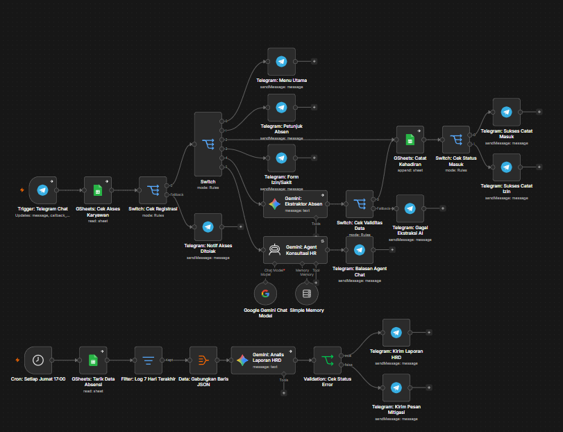

# 🤖 Enterprise AI Attendance Agent & Analytics System (n8n + Gemini AI)

Sistem ekosistem absensi karyawan harian berbasis AI Agent interaktif dan generator laporan analitik mingguan otomatis untuk HRD yang berjalan secara simultan dalam satu kanvas *workflow*. Sistem ini dibangun menggunakan arsitektur *low-code* tangguh, hemat biaya token API, serta dilengkapi penanganan eror tingkat produksi (*production-ready error handling*).

---

## 1. Problem Statement (Masalah Bisnis)
Banyak perusahaan menghadapi kendala dalam mengelola absensi karyawan lapangan atau yang memiliki mobilitas tinggi. Aplikasi absensi tradisional sering kali dirasa berat, kaku, dan membutuhkan proses adaptasi yang lama bagi karyawan. 

Di sisi lain, Tim HRD kehilangan banyak waktu produktif setiap akhir pekan hanya untuk merekap data mentah dari Google Sheets secara manual guna mencari tren kehadiran, karyawan yang sering izin, atau kendala operasional perusahaan.

### Solusi yang Built-in:
Sistem otomatisasi cerdas berbasis *Low-Code AI* yang menyelesaikan dua masalah sekaligus:
1. **Sisi Karyawan (Harian):** Absensi instan via Telegram menggunakan bahasa sehari-hari yang diekstraksi otomatis secara valid oleh AI.
2. **Sisi HRD (Mingguan):** Sistem analitik berbasis waktu (*cron-job*) yang otomatis menarik, mengelompokkan, merangkum, dan mengirimkan laporan *Auto-Summary* langsung ke Telegram HRD setiap Jumat sore.

---

## 2. System Architecture (Arsitektur Sistem)

Seluruh sistem ini berjalan terintegrasi di dalam satu *workflow* n8n tunggal (*Monolith Canvas*) yang terbagi menjadi dua fungsi utama:

### Alur 1: Registrasi & Absensi Harian (Interactive AI Agent)
Alur ini menangani interaksi langsung dengan karyawan secara *real-time*, lengkap dengan validasi alasan izin otomatis:

[ Trigger: Telegram Chat ] ──> [ GSheets: Cek Akses Karyawan ]
                                              │
                     ┌────────────────────────┴────────────────────────┐
                     ▼ (Belum Terdaftar)                               ▼ (Terdaftar)
       [ Telegram: Notif Akses Ditolak ]                         [ Switch: Cek Menu ]
                                                                       │
                                                       ┌───────────────┴───────────────┐
                                                       ▼ (Menu Absen)                  ▼ (Menu Tanya HR)
                                         [ Gemini: Ekstraktor Absen ]         [ Gemini: Agent Konsultasi HR ]
                                                       │                               │
                                         [ Switch: Cek Validitas Data ]       [ Telegram: Balasan Agent Chat ]
                                                       │
                     ┌─────────────────────────────────┴─────────────────────────────────┐
                     ▼ (Data Tidak Valid / Alasan Izin Tidak Masuk Akal)                 ▼ (Data Valid & Masuk Akal)
       [ Telegram: Gagal Ekstraksi AI ]                                     [ GSheets: Catat Kehadiran ]
       (Menyuruh isi alasan yang valid)                                                  │
                                                                            [ Switch: Cek Status Masuk ]
                                                                             ┌───────────┴───────────┐
                                                                             ▼ (Masuk)               ▼ (Izin)
                                                                 [ Telegram: Sukses Catat Masuk ]  [ Telegram: Sukses Catat Izin ]

### Alur 2: Laporan Mingguan HRD & Data Analitik (Cron & Aggregation)
Alur otomatisasi terjadwal yang mengolah data log kehadiran menjadi draf laporan eksekutif untuk pihak HRD:

[ Cron: Setiap Jumat 17:00 ] ──> [ GSheets: Tarik Data Absensi ]
                                                │
                                                ▼
                                    [ Filter: Log 7 Hari Terakhir ]
                                                │
                                                ▼
                                    [ Data: Gabungkan Baris JSON ] (Menghemat Token API)
                                                │
                                                ▼
                                    [ Gemini: Analis Laporan HRD ]
                                                │
                                                ▼
                                    [ Validation: Cek Status Error ] (Error Handling)
                                       ├───> SUCCESS (True) ──> [ Telegram: Kirim Laporan HRD ]
                                       └───> FAILED (False) ──> [ Telegram: Kirim Pesan Mitigasi ]

---

## 3. 📊 Database Structure (Google Sheets)
Sistem ini menggunakan Google Sheets sebagai database dengan dua lembar kerja (sheets) utama yang dikonfigurasi secara relasional untuk efisiensi pengecekan data.

💡 **Template Database Resmi:** [Salin Template Google Sheets Di Sini](https://docs.google.com/spreadsheets/d/1eGOo_fGpeERqaKo2QNR3uZ6aInpxoL7-7v6CBof82wQ/edit?usp=sharing)

### A. Sheet: Switch Cek Karyawan (Master Data)
Digunakan oleh node GSheets: Cek Akses Karyawan untuk memvalidasi hak akses pengguna Telegram:
* Telegram_ID (Key): Identitas unik akun Telegram karyawan untuk mencegah manipulasi data.
* Nama_Karyawan: Nama lengkap karyawan yang terdaftar resmi.
* Status_Aktif: Status verifikasi apakah karyawan masih aktif bekerja atau tidak.

### B. Sheet: Log_Absensi (Transaction Data)
Tempat penyimpanan data akhir yang dicatat secara otomatis oleh node GSheets: Catat Kehadiran:
* Timestamp: Waktu otomatis saat melakukan absen (mencegah kecurangan waktu).
* Telegram_ID: ID Karyawan yang melakukan absensi.
* Nama_Karyawan: Nama lengkap karyawan yang ditarik secara relasional dari master data untuk validasi laporan.
* Tipe_Absen: Status kehadiran karyawan (**Masuk** / **Izin**).
* Alasan: Catatan atau konfirmasi alasan medis/izin yang sudah lolos validasi kontekstual oleh Gemini AI.

---

## 4. Fitur Unggulan Produksi (Production-Ready Features)
* Smart Validation Gate (Switch: Cek Validitas Data): Sistem melakukan penyaringan (gatekeeping) data yang buruk sebelum masuk ke database. Jika karyawan memilih opsi "Izin" tetapi menuliskan alasan yang main-main (misal: "Izin karena mau tidur"), Gemini akan mendeteksi ketidakvalidan tersebut, dan sistem akan menolak absensi serta meminta karyawan memasukkan alasan yang logis.
* Token Efficiency Optimization: Melalui node Data: Gabungkan Baris JSON, ratusan baris data absensi disatukan terlebih dahulu menjadi satu paket dokumen sebelum dikirim ke Gemini. Hal ini memangkas biaya operasional API secara drastis karena Gemini hanya dipanggil 1 kali untuk merangkum seluruh data, bukan melakukan perulangan (looping request).
* Fault-Tolerant & Fallback System: Node krusial (Gemini & Google Sheets) dikonfigurasi dengan opsi On Error = Continue Regularly. Jika API eksternal mengalami gangguan atau menyentuh rate limit, alur dialihkan ke node Validation: Cek Status Error untuk mengirimkan pesan mitigasi yang ramah kepada pengguna, menjaga sistem agar tidak mati total (crash).
* Robust Entity Extraction: Menggunakan ekspresi JavaScript absolut {{ $('Gemini: Analis Laporan HRD').first().json.content.parts[0].text }} yang dipadukan dengan konfigurasi Parse Mode Markdown (Legacy) pada Telegram untuk menjamin teks laporan terurai sempurna tanpa risiko eror akibat karakter khusus AI.

---

## 5. Business Impact & Value (Dampak Nyata)
Implementasi arsitektur Low-Code AI ini memberikan keunggulan kompetitif yang masif bagi efisiensi operasional perusahaan dibandingkan metode Hard-Coding tradisional:

| Metrik Evaluasi | Backend Tradisional (Node.js/Python dari Nol) | Arsitektur Solusi Saya (n8n + Gemini AI) |
| :--- | :--- | :--- |
| Waktu Rekap HRD | Manual mengolah tabel (~2-3 jam/minggu). | 0 Jam (100% Otomatis), laporan langsung masuk ke Telegram HRD setiap Jumat. |
| Biaya Server & Infra | Sewa Cloud/VPS Bulanan ($15 - $30/bulan). | $0 / Sangat Minim (Menggunakan n8n Cloud Starter & Free-tier Gemini API). |
| Kecepatan Development | 1 hingga 2 Weeks (Coding, Setup DB, Testing). | Kurang dari 48 Jam (Agile & langsung siap pakai). |
| Resiliensi Sistem | Perlu kode monitoring tambahan (Catch Error block). | Otomatis Terproteksi lewat visualisasi mitigasi On Error & Fallback Message. |

---

## 6. 📸 Visual Workflow Canvas
Berikut adalah arsitektur penuh dari kanvas n8n tunggal yang mengintegrasikan seluruh sistem di atas:

---

## 7. Cara Penggunaan & Konfigurasi
1. Unduh file `smart-hr-attendance-system.json` dari repository ini.
2. Buat salinan (Make a copy) dari **Template Google Sheets** pada poin nomor 3, lalu hubungkan dengan akun Google Anda.
3. Buka platform n8n Anda, buat workflow baru, lalu impor file JSON tersebut.
4. Hubungkan kredensial Anda pada node Telegram Bot API, Google Sheets, dan Google Gemini Chat Model.
5. Pada node Telegram: Kirim Laporan HRD, sesuaikan Chat ID dengan ID tim HRD atau akun Telegram Anda.
6. Aktifkan workflow dengan mengklik tombol Publish di pojok kanan atas hingga berubah status menjadi Active. Kedua fitur (Absensi Harian & Laporan Mingguan) akan langsung berjalan secara otomatis.
